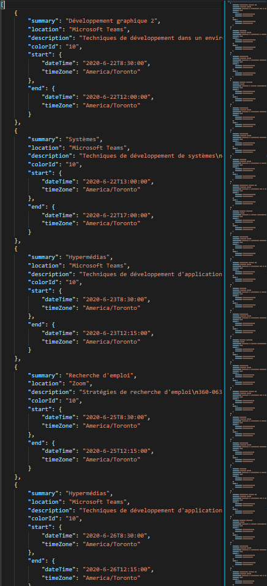
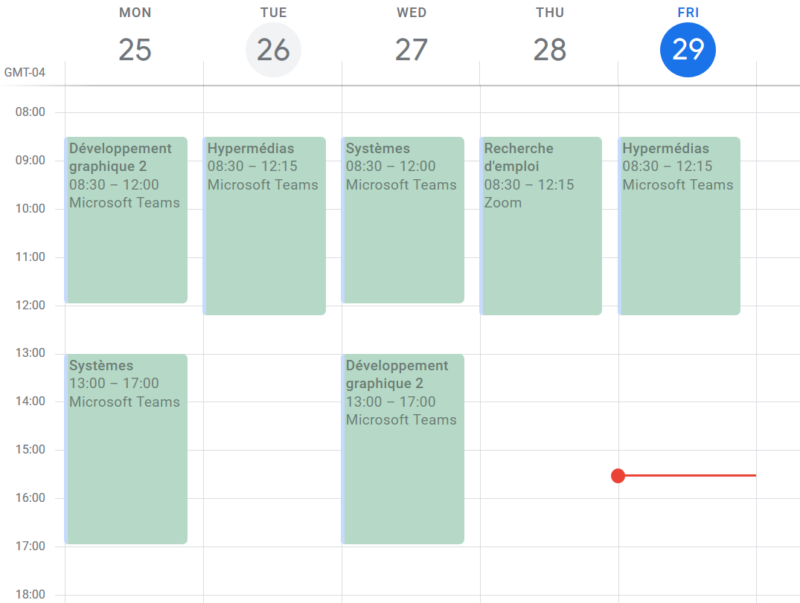

# Calendrier Scholaire To Google
I made this tool because I wanted a fast way to check my schedule on my phone

---
If you want to use this, you will need credentials from google calendar to make the api work

## Whats happening

 original image | reading and gathering of data | to my personal google calendar
:--------------:|:-----------------------------:|:------------------------------:
||